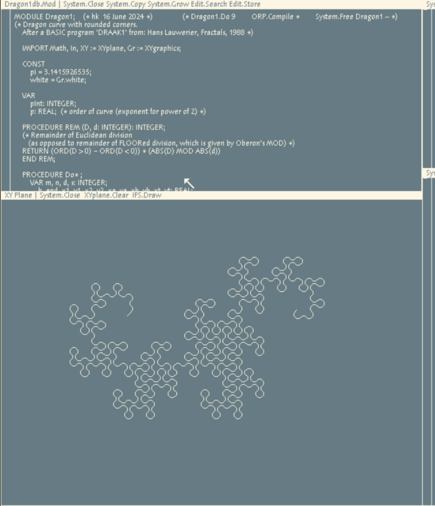

# Dragon curves with rounded corners

[Dragon curves](https://mathworld.wolfram.com/DragonCurve.html) are interesting space filling curves that you can approximate by endlessly folding a slip of paper. Apparently I'm not the only one who is fascinated by them; [Donald Knuth](https://en.wikipedia.org/wiki/Donald_Knuth) has one decorating a wall in his home: https://www.youtube.com/watch?v=v678Em6qyzk (and yes, it has a bug).

Dragon and Dragon1.Mod contain Oberon source code for dragon curves in the Oberon System.  
The commands Dragon.Do and Dragon1.Do accept an optional integer argument to determine the order of the curve.
The paper folding can best be seen in the simpler version Dragon.Mod. 
Dragon1.Mod is for dragon curves with rounded corners like the one on the tile wall in Donald Knuth's home.

The modules make use of XYgraphics.Mod (in this repo) and also of XYplane.Mod and Math.Mod (in my repo Oberon-07).

Be sure to use the corrected [Math.ln(x)](https://github.com/hansklav/Oberon-07-Math.ln) if you use this function in the implementation of [Math.power(x, e)](https://github.com/hansklav/Oberon-07/blob/master/Math.Mod).

With RISC Project Oberon 2013 firmware for FPGA and emulators thereof dated before July 2024 there is a problem with the rendering of dragon curves with orders that are even numbers < 14 (e.g. see the second screenshot below for order 10). Even number orders ≥ 14 do produce dragons, but considerably smaller (see the third screenshot; actually they more resemble labradoodles than dragons ;-) 
The newest firmware and updated emulators do not have this issue.

For reference and comparison I also added the original BASIC source by Hans Lauwerier (DRAAK1.BAS) and a Python implementation of it (dragon1.py).
 

 
