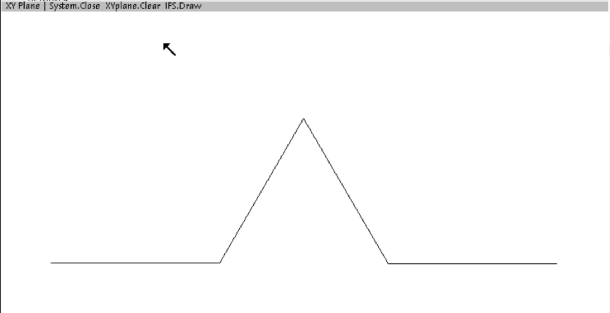
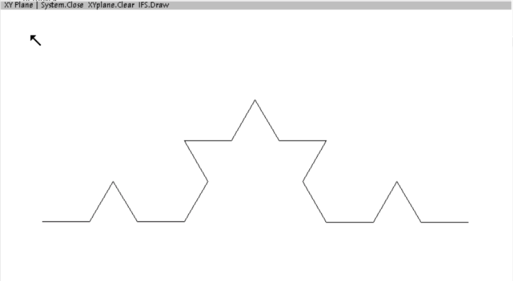
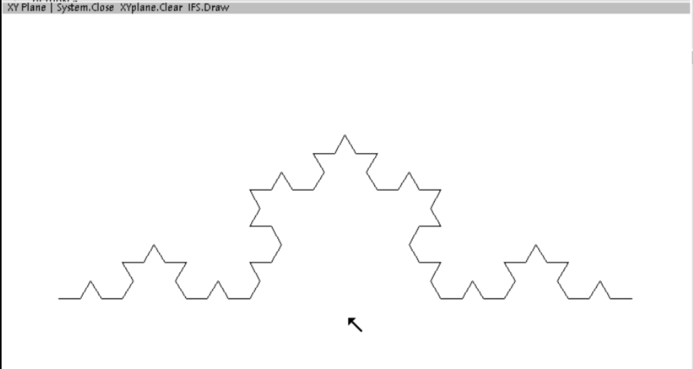

# Von Koch's curve in several orders

In 1904 the Swedish mathematician [Helge von Koch](https://mathshistory.st-andrews.ac.uk/Biographies/Koch/) published about a curve without tangents,
for the mathematicians of that period a shocking finding.

The curve is constructed recursively as follows: 
1. divide a line into three equal segments
2. replace the middle segment by the two other sides of an equilateral triangle
3. to each of the (now 4) line segments apply the procedure which starts at 1.

    
