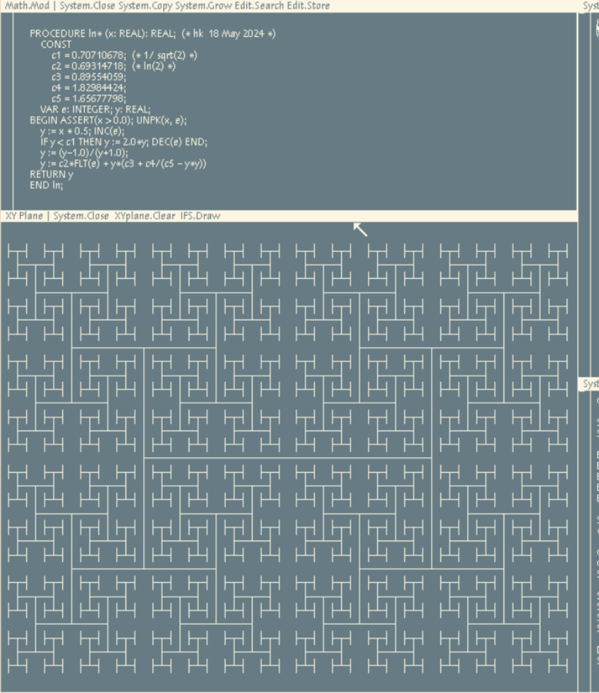

# Fractals-in-Oberon-07

Module H1 is for a fractal on the letter H.  
It makes use of XYgraphics.Mod and also of XYplane.Mod and Math.Mod (in my repository Oberon-07).

Be sure to use the corrected [Math.ln(x)](https://github.com/hansklav/Oberon-07-Math.ln) if you use this function in the implementation of Math.power(x, e).
 

