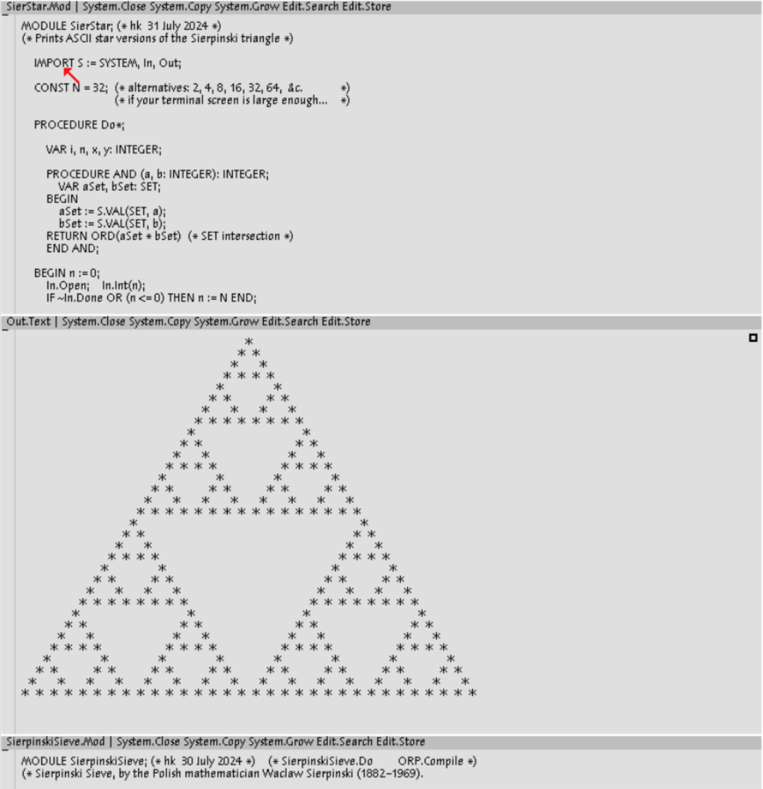
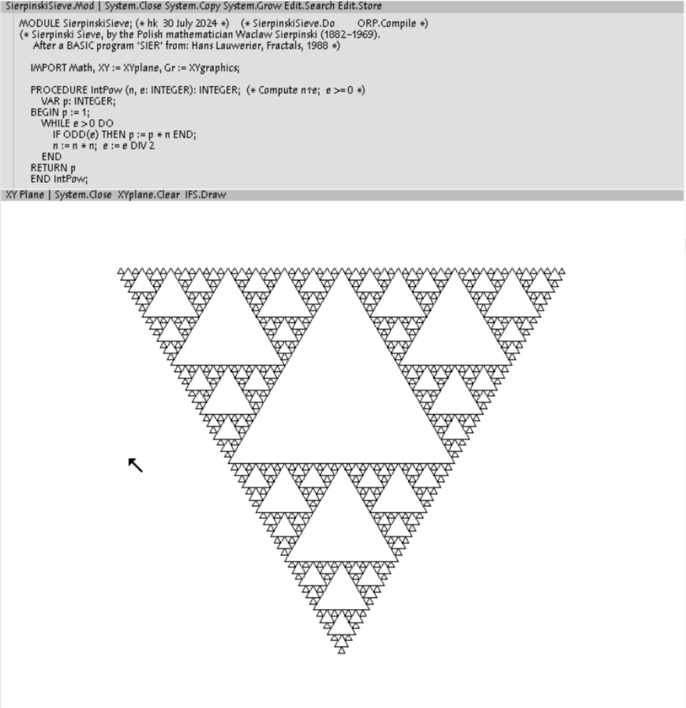
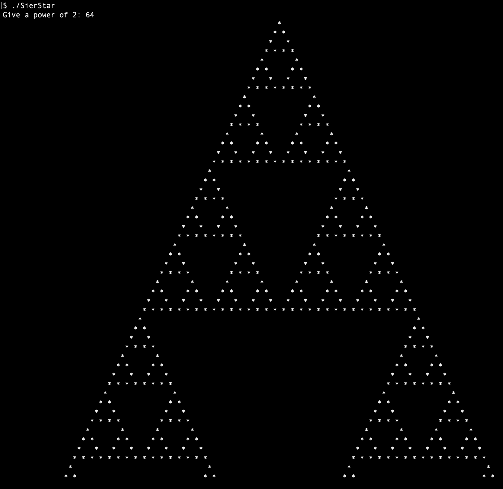

# Sierpinski’s sieve for Oberon System V5 and the POSIX console

In 1915 the Polish mathematician [Wacław Sierpiński](https://mathshistory.st-andrews.ac.uk/Biographies/Sierpinski/) published about his triangle, which in its limit form has an area of zero. 

Its algorithm is as follows:
1. Take a triangle
2. Connect the midpoints of its sides, resulting in 4 smaller triangles
3. Remove the middle triangle
4. Apply 1.…4. to the remaining triangles

For nice ASCII art in Oberon System you will need the font Courier10.Fnt (in my repo Oberon-07).

